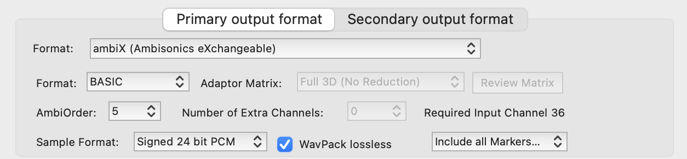
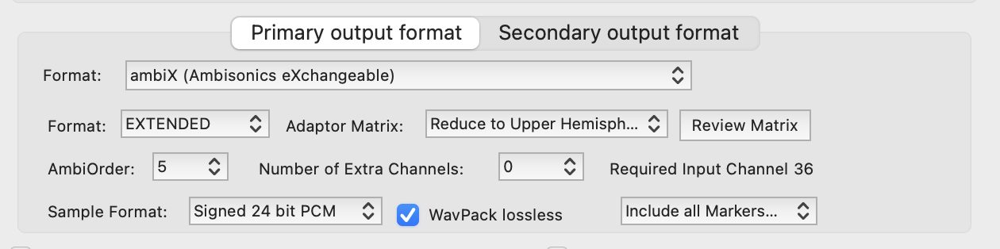
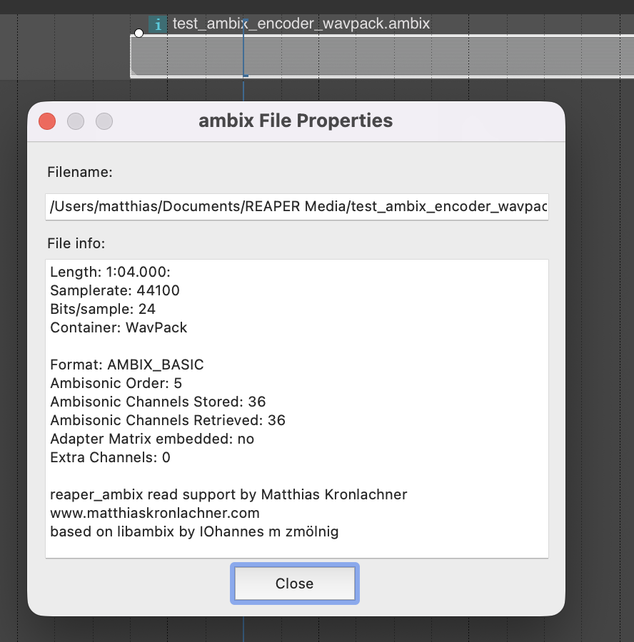

reaper_ambix
============

REAPER plug-in that adds read/write support for `.ambix` files following the
ambiX (Ambisonics eXchangeable) specification [1].

Output can be written uncompressed (CAF container) or with WavPack lossless
compression. Reading auto-detects the container from the file's magic bytes.

[1] C. Nachbar, F. Zotter, E. Deleflie, A. Sontacchi. *ambiX – A Suggested
Ambisonics Format.* Proceedings of the Ambisonics Symposium 2011, Lexington,
KY, June 2–3, 2011.
[ambisonics.iem.at](https://ambisonics.iem.at/proceedings-of-the-ambisonics-symposium-2011/ambix-a-suggested-ambisonics-format)


Screenshots
-----------

Render settings (REAPER's render dialog) — pick ambisonic order, format,
sample format and toggle WavPack lossless compression:



EXTENDED format with an adaptor matrix — reduces the stored channel count
for restricted geometries (e.g. upper hemisphere) while keeping a full
periphonic decoder available via the embedded matrix:



File properties for a loaded `.ambix` media item — shows the container,
ambisonic order, channel layout and adapter matrix info:




Releases
--------

Signed installers for Windows (`.exe`) and macOS (`.pkg`) are built automatically
and published in [GitHub Releases](https://github.com/kronihias/reaper_ambix/releases).

To cut a new release:

1. Bump the `VERSION` file
2. Commit and push
3. Create a GitHub release with the tag `vX.Y.Z` (matching `VERSION`)
4. Publishing the release triggers the build + signing workflow

Code-signing setup is documented in [.github/CODE_SIGNING.md](.github/CODE_SIGNING.md).


Building from source
--------------------

Requirements:

- CMake 3.10+ and a C++ toolchain
- macOS: Xcode command-line tools
- Windows: Visual Studio 2022 (Desktop development with C++)

`libambix` (with native CAF backend) and `WavPack` are vendored as git
submodules and linked statically — no external audio libraries required.

```
git clone --recursive https://github.com/kronihias/reaper_ambix
cd reaper_ambix
./scripts/setup.sh        # init submodules + cmake configure
cmake --build build-dev   # writes the plug-in straight into REAPER's UserPlugins
```

For signed/notarized installer builds, see [scripts/build_osx.sh](scripts/build_osx.sh)
and [scripts/build_win.bat](scripts/build_win.bat).


Credits
-------

- *libambix* by IOhannes m zmölnig (LGPL) — https://git.iem.at/ambisonics/libambix
- *WavPack* by David Bryant — https://github.com/dbry/wavpack
- Originally based on Xenakios' `reaper_libsndfilewrapper`


Author
------

2014–2026 Matthias Kronlachner

m.kronlachner (ät) gmail.com — https://www.matthiaskronlachner.com
