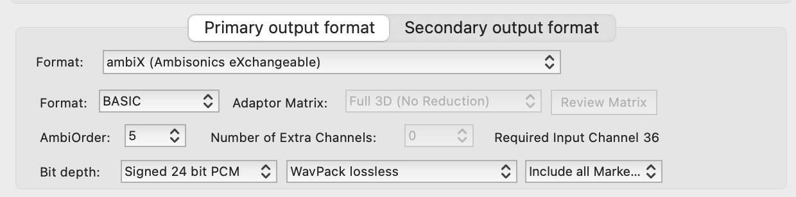
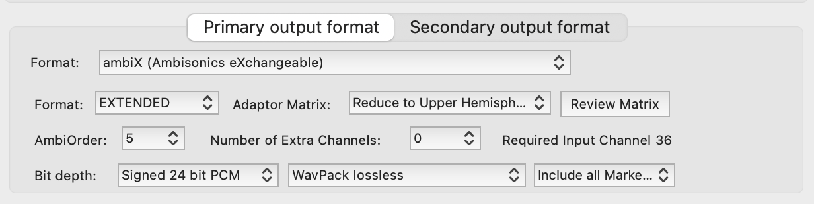
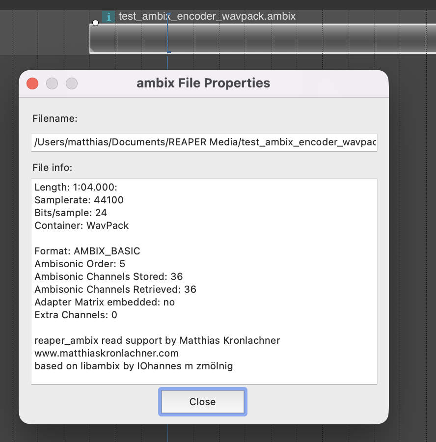

reaper_ambix
============

REAPER plug-in that adds read/write support for `.ambix` files following the
ambiX (Ambisonics eXchangeable) specification [1].

Output can be written uncompressed (CAF container) or with WavPack lossless
compression. Reading auto-detects the container from the file's magic bytes.

It also adds two actions to REAPER's main action list — see
[Actions](#actions) below.

[1] C. Nachbar, F. Zotter, E. Deleflie, A. Sontacchi. *ambiX – A Suggested
Ambisonics Format.* Proceedings of the Ambisonics Symposium 2011, Lexington,
KY, June 2–3, 2011.
[ambisonics.iem.at](https://ambisonics.iem.at/proceedings-of-the-ambisonics-symposium-2011/ambix-a-suggested-ambisonics-format)


Actions
-------

The extension registers two actions in REAPER's main action list.

### ambiX: Normalize selected item(s) to target loudness (LUFS)...

It asks for a target level, measures the integrated loudness of each selected
item's active take, and sets the take volume so the item lands on that target.
The measured and applied values are printed to the ReaScript console, and the
whole run is a single undo point. The target is remembered between sessions.

Analysis runs behind a progress dialog and can be cancelled — cancelling
applies nothing. The work is done in small slices on the main thread rather
than on a worker, so REAPER stays responsive without any of the API being
called off-thread.

The measurement is ITU-R BS.1770-4 (K-weighting, 400 ms blocks at 75 % overlap,
absolute -70 LUFS and relative -10 LU gating), implemented locally in
[src/loudness.cpp](src/loudness.cpp) — no external library is involved.

Channel handling follows BS.1770-5 Annex 3:

| Source | Measured |
| --- | --- |
| Ambisonic (channel count is a perfect square ≥ 4: FOA 4, SOA 9, TOA 16, …) | W channel only, G = 1.00 |
| Up to 7.1.4 (12 ch, Dolby/SMPTE order) | LFE excluded, Ls/Rs at G = 1.41, everything else G = 1.00 |
| 9.1.4 (14 ch, Dolby/SMPTE order) | as above, plus Lss/Rss at G = 1.41 |
| Mono / stereo | G = 1.00 per channel |

Measuring only W for ambisonic material is both correct — per Peters & Epain
(AES 154th, 2023) applying BS.1770 to W matches a full loudspeaker rendering —
and much cheaper, since the other HOA channels never have to be read.

Only channels that carry weight are read at all. A fifth-order bed is 36
channels but costs one; an LFE is requested but never filtered; and a source
wider than the 12-channel surround layout is capped there instead of running
K-weighting over channels that contribute nothing.

Note that a 4-channel item is read as first-order ambisonics rather than quad
or LCRS, which is the useful default for this plugin but worth knowing if you
point the action at a non-ambisonic 4-channel file.

### ambiX: Set channel count of selected track(s) and their sends...

Sets the track channel count on every selected track and resizes the sends that
carried those tracks' full width, so a whole encoder-into-bus chain changes
ambisonic order in one step. Working at first order and switching to fifth just
before rendering saves a lot of CPU; doing it by hand across a large session is
tedious and easy to get wrong.

Select the bus **and** every track feeding it, run the action, and enter the
channel count. Ambisonic orders are the perfect squares — 4, 9, 16, 25, 36, 49,
64, 81, 100, 121 — and REAPER only has even channel counts, so an odd order is
rounded up to the next even number. Up to 128 channels (REAPER 7; older
versions clamp to 64). The count is remembered between sessions and the whole
run is a single undo point.

A send is resized only if it carried its source track's entire width from
channel 1 into the destination's channel 1. Mono sends, sends starting at a
channel offset, and sends that only ever carried part of the track — a stereo
monitor tap, a 10-channel bed feed off a 128-channel track — keep the width
they have. Hardware outputs are never touched.

Only sends *out of* selected tracks are resized. A receive from a track you did
not select comes from a track whose width is not changing, so touching it would
break the routing rather than follow it. If a resized send now feeds a track
narrower than the new count, the console says so by name — that is usually a
track you forgot to select.

This is a native port of
[`change_channel_count.py`](https://github.com/kronihias/ambix/blob/master/reaper_tools/change_channel_count.py)
from the ambix plug-in suite (Matthias Kronlachner and Daryl Pierce). The Python
original needed a configured Python interpreter and edited the track state chunk
with regular expressions; this uses `I_NCHAN` and `I_SRCCHAN`/`I_DSTCHAN` and
ships inside the extension, so it installs with reaper_ambix and needs no
interpreter.


Screenshots
-----------

Render settings (REAPER's render dialog) — pick ambisonic order, format,
sample format and toggle WavPack lossless compression:



EXTENDED format with an adaptor matrix — reduces the stored channel count
for restricted geometries (e.g. upper hemisphere) while keeping a full
periphonic decoder available via the embedded matrix:



File properties for a loaded `.ambix` media item — shows the container,
ambisonic order, channel layout and adapter matrix info:




Releases
--------

Signed installers for Windows (`.exe`, x64 and ARM64), macOS (`.pkg`, universal)
and a Linux tarball (x86_64 and aarch64) are built automatically and published in
[GitHub Releases](https://github.com/kronihias/reaper_ambix/releases).


ReaPack
-------

The extension is also distributed through [ReaPack](https://reapack.com/), which
installs the bare plugin file directly (no installer). In REAPER choose
*Extensions → ReaPack → Import repositories…* and paste:

```
https://github.com/kronihias/reaper_ambix/raw/master/index.xml
```

Then open *Extensions → ReaPack → Browse packages*, find **reaper_ambix** under
the *Extensions* category, install, and restart REAPER. ReaPack downloads the
matching per-platform binary straight from the GitHub release assets.

The package index ([index.xml](index.xml)) is generated from
[Extensions/reaper_ambix.ext](Extensions/reaper_ambix.ext) by
`scripts/reapack_index.sh` (cfillion's `reapack-index` tool).


Cutting a release
-----------------

1. Bump the `VERSION` file **and** the `@version` in
   [Extensions/reaper_ambix.ext](Extensions/reaper_ambix.ext) (keep them in
   sync), update the `@changelog`, and commit.
2. Run `./scripts/reapack_index.sh` to regenerate `index.xml`, and commit it.
3. Publish a GitHub release tagged `vX.Y.Z` (matching `VERSION`). Publishing
   triggers the build + signing workflow, which builds the installers **and**
   uploads the raw per-platform binaries (`.dll`/`.dylib`/`.so`) that ReaPack
   pulls from the release assets.

Code-signing setup is documented in [.github/CODE_SIGNING.md](.github/CODE_SIGNING.md).


Building from source
--------------------

Requirements:

- CMake 3.13+ and a C++ toolchain
- macOS: Xcode command-line tools
- Windows: Visual Studio 2022 (Desktop development with C++)
- Linux: `build-essential`

`libambix` (with native CAF backend) and `WavPack` are vendored as git
submodules and linked statically — no external audio libraries required.

```
git clone --recursive https://github.com/kronihias/reaper_ambix
cd reaper_ambix
./scripts/setup.sh        # init submodules + cmake configure
cmake --build build-dev   # writes the plug-in straight into REAPER's UserPlugins
```

For signed/notarized installer builds, see [scripts/build_osx.sh](scripts/build_osx.sh),
[scripts/build_win.bat](scripts/build_win.bat) and
[scripts/build_linux.sh](scripts/build_linux.sh).

**Note:** `scripts/setup.sh` configures the dev tree with
`REAPER_AMBIX_INSTALL_USER_PLUGINS=ON`, so a rebuild writes into the *user*
plugin folder (`~/Library/Application Support/REAPER/UserPlugins` on macOS,
`~/.config/REAPER/UserPlugins` on Linux). The macOS installer writes into the
*system* folder (`/Library/Application Support/REAPER/UserPlugins`) instead.
REAPER scans both and the user copy wins on identical filenames, so **delete
the dev build before testing an installer or ReaPack install** — otherwise it
silently shadows the packaged one and you keep running the old binary.

The option itself defaults to **OFF** precisely so that no build ends up in a
folder REAPER loads from unless you asked for it; only the dev tree opts in.


Tests
-----

The loudness measurement has no REAPER dependency and is covered by a standalone
test suite ([tests/test_loudness.cpp](tests/test_loudness.cpp)): the EBU Tech 3341
integrated-loudness compliance cases, the BS.1770-5 channel weightings, the
ambisonic layout detection, sample-rate independence, and a check that the
derived K-weighting coefficients reproduce the values tabulated in BS.1770-4 at
48 kHz.

`REAPER_AMBIX_BUILD_PLUGIN=OFF` skips the extension itself, so the tests build
without the vendored submodules — a plain `git clone` is enough:

```
cmake -S . -B build-tests -DREAPER_AMBIX_BUILD_TESTS=ON -DREAPER_AMBIX_BUILD_PLUGIN=OFF
cmake --build build-tests --target test_loudness
ctest --test-dir build-tests --output-on-failure
```

CI runs this on every push, and a release build will not package anything until
it passes.


Credits
-------

- *libambix* by IOhannes m zmölnig (LGPL) — https://git.iem.at/ambisonics/libambix
- *WavPack* by David Bryant — https://github.com/dbry/wavpack
- Originally based on Xenakios' `reaper_libsndfilewrapper`


Author
------

2014–2026 Matthias Kronlachner

m.kronlachner (ät) gmail.com — https://www.matthiaskronlachner.com
