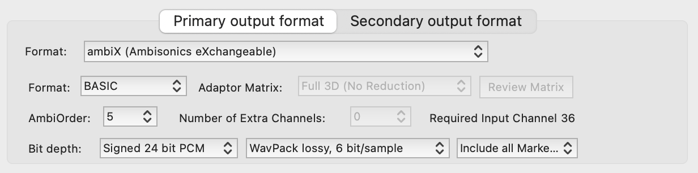
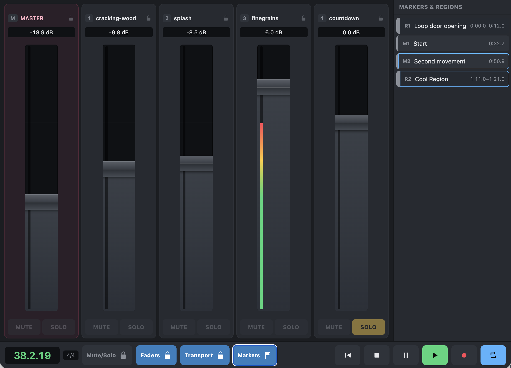

reaper_ambix
============

REAPER tools, installable from one [ReaPack](https://reapack.com/) repository:

- **reaper_ambix** — read/write `.ambix` files (ambiX [1]) plus loudness,
  channel-count and FuMa conversion actions
- **REAPER Live** — touch mixer and transport for a phone or tablet


Installation
------------

In REAPER: *Extensions → ReaPack → Import repositories…* and paste

```
https://github.com/kronihias/reaper_ambix/raw/master/index.xml
```

Then *Extensions → ReaPack → Browse packages* and install **reaper_ambix**
(under *Extensions*, restart REAPER afterwards) and/or **REAPER Live** (under
*WebInterfaces*, see [setup](#reaper-live)).

Installers for Windows, macOS and Linux are also on
[GitHub Releases](https://github.com/kronihias/reaper_ambix/releases).


reaper_ambix
------------

Adds `.ambix` as a render format and a readable media type. Files are written
as uncompressed CAF, WavPack lossless, or WavPack lossy (hybrid mode at 6, 4 or
3 bits/sample — the noise floor follows each channel's level, so it survives
decoding and rotation; keep a lossless master). The item's source properties
show which one a file is.

<table><tr>
  <td width="57%">
    
    
    
  </td>
  <td width="43%"></td>
</tr></table>

### Actions

| Action | What it does |
| --- | --- |
| **Normalize selected item(s) to target loudness (LUFS)…** | Sets take volume so each item hits the target. BS.1770-4; ambisonic items (4, 9, 16, … ch) are measured on W only [2], surround up to 9.1.4 per BS.1770-5. |
| **Measure loudness of selected item(s) (LUFS)** | Same measurement, printed to the console, changes nothing. |
| **Set channel count of selected track(s) and their sends…** | Changes the channel count of the selected tracks and resizes their sends starting at channel 1 — switch a whole session between orders in one step. Select the bus *and* its sources. |
| **Convert selected item(s) to .ambix file(s)…** | Writes each item (pre-FX, unstretched) as an `.ambix` next to its source; optionally adds it as a take or replaces the source. |
| **Convert selected item(s) from FuMa to ambiX…** | FuMa (up to 3rd order) → ACN/SN3D, per the ambiX paper; the result is added as a new take by default. |

Note: a 4-channel item is treated as first-order ambisonics, not quad.


REAPER Live
-----------

One strip per track (meter, fader, mute/solo) plus a transport bar, served by
REAPER's web server. Padlocks guard mute/solo, faders (also per track) and
transport; faders drag relatively and double-tap resets to 0 dB. A
collapsible panel lists all markers and regions and jumps to them.



Setup: *Preferences → Control/OSC/web → Add → Web browser interface*, pick a
port and `reaper_mixer_live.html` as default page, then open
`http://<computer-ip>:<port>/` on the device. The web API has no
authentication — use a trusted network only.


Development
-----------

### Building

Needs CMake 3.13+ and a C++ toolchain (Xcode CLT / VS 2022 / build-essential).
libambix and WavPack are vendored submodules.

```
git clone --recursive https://github.com/kronihias/reaper_ambix
cd reaper_ambix
./scripts/setup.sh
cmake --build build-dev   # installs into the user UserPlugins folder
```

The dev build lands in the *user* UserPlugins folder and shadows installer or
ReaPack builds — delete it before testing those. Installer builds:
[scripts/build_osx.sh](scripts/build_osx.sh),
[scripts/build_win.bat](scripts/build_win.bat),
[scripts/build_linux.sh](scripts/build_linux.sh).

### Tests

Loudness ([tests/test_loudness.cpp](tests/test_loudness.cpp), EBU Tech 3341)
and FuMa conversion ([tests/test_fuma.cpp](tests/test_fuma.cpp) — libambix's
`AMBIX_MATRIX_FUMA` is wrong, so it is not used). No submodules needed:

```
cmake -S . -B build-tests -DREAPER_AMBIX_BUILD_TESTS=ON -DREAPER_AMBIX_BUILD_PLUGIN=OFF
cmake --build build-tests
ctest --test-dir build-tests --output-on-failure
```

### Releasing

1. Bump `VERSION` and `@version`/`@changelog` in
   [Extensions/reaper_ambix.ext](Extensions/reaper_ambix.ext), commit.
2. Run `./scripts/reapack_index.sh` and commit `index.xml`.
3. Publish a GitHub release tagged `vX.Y.Z`; CI builds, signs and uploads the
   binaries ReaPack pulls. See [.github/CODE_SIGNING.md](.github/CODE_SIGNING.md).

REAPER Live is versioned separately in
[WebInterfaces/reaper_mixer_live.www](WebInterfaces/reaper_mixer_live.www).


References
----------

[1] C. Nachbar, F. Zotter, E. Deleflie, A. Sontacchi. *ambiX – A Suggested
Ambisonics Format.* Ambisonics Symposium 2011.
[ambisonics.iem.at](https://ambisonics.iem.at/proceedings-of-the-ambisonics-symposium-2011/ambix-a-suggested-ambisonics-format)

[2] N. Peters, N. Epain. *Loudness Perception of Scene-Based Audio across
Loudspeaker Configurations and HOA Orders.* AES Convention Paper 10658, 2023.


Credits
-------

- [libambix](https://git.iem.at/ambisonics/libambix) by IOhannes m zmölnig (LGPL)
- [WavPack](https://github.com/dbry/wavpack) by David Bryant
- Originally based on Xenakios' `reaper_libsndfilewrapper`
- Channel-count action ported from
  [change_channel_count.py](https://github.com/kronihias/ambix/blob/master/reaper_tools/change_channel_count.py)
  (Matthias Kronlachner, Daryl Pierce)

2014–2026 Matthias Kronlachner — m.kronlachner (ät) gmail.com —
https://www.matthiaskronlachner.com
